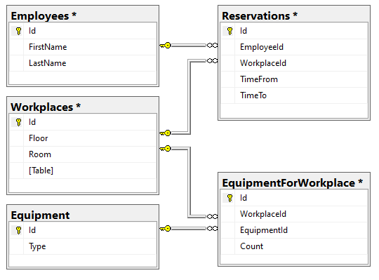
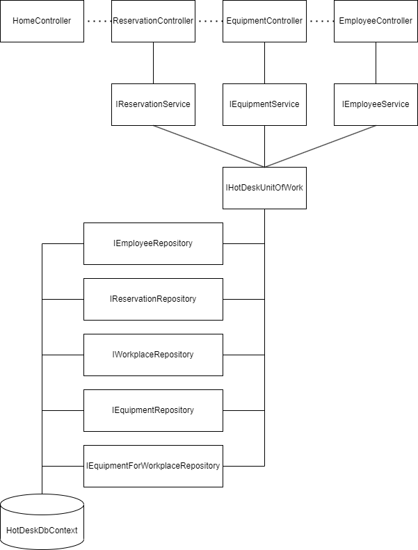

# HotDesk

- In this project you can reserve workplaces, add new equipment and add new employees.
- While creating the reservation you can select an employee, choose dates of reservation, choose workplace and add additional equipment.
- Additional equipment is moved between workplaces automatically from the closest free workplace.

## Configuration
#### 1. Connection String
Change your connection string in [appsettings.json](appsettings.json)
```json
"ConnectionStrings": {
    "Default": "Server=(localdb)\\mssqllocaldb;Database=HotDeskDb;Trusted_Connection=True;"
  }
```

#### 2. Initiate database
Run `update-database` command in Package Manager Console.
Sample data would be inserted into database automatically by using the [HotDeskSeeder](HotDeskSeeder.cs)

## Database structure


## Architecture
- Controllers are used for communicating between user and services
- [ReservationService](Services/ReservationService.cs) is used to get the list of non-reserved workplaces,
create new reservations with additional equipment that are taken automatically from other non-reserved workplaces
- [EquipmentService](Services/EquipmentService.cs) is used for adding new equipment to the choosen workplace
- [EmployeeService](Services/EmployeeService.cs) is used for adding new employees
- All the repositories are accessed from [HotDeskUnitOfWork](UnitsOfWork/HotDeskUnitOfWork.cs) class

